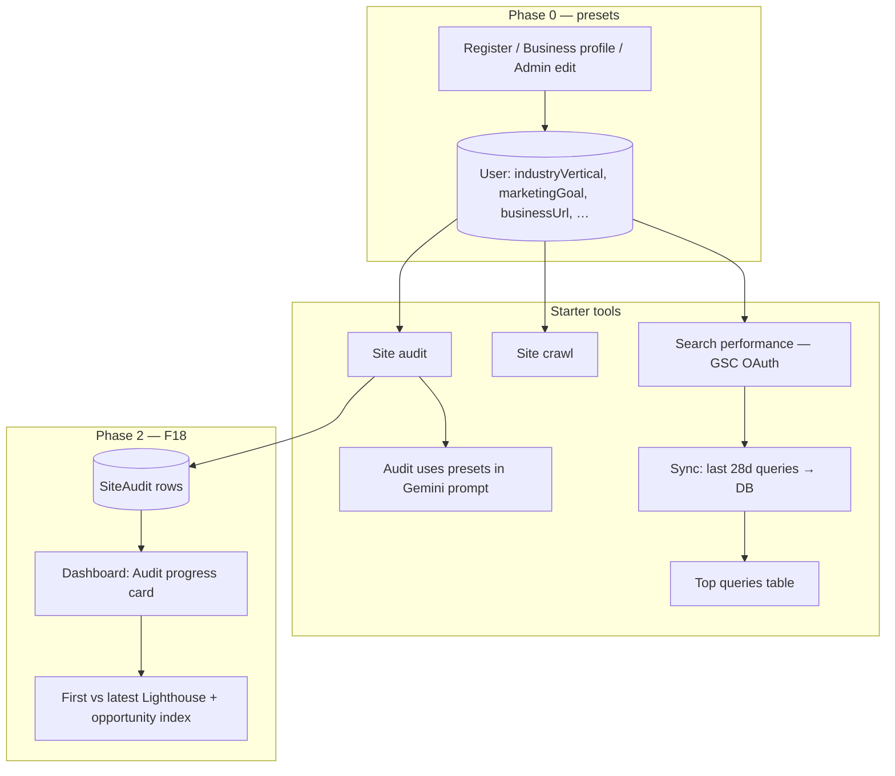
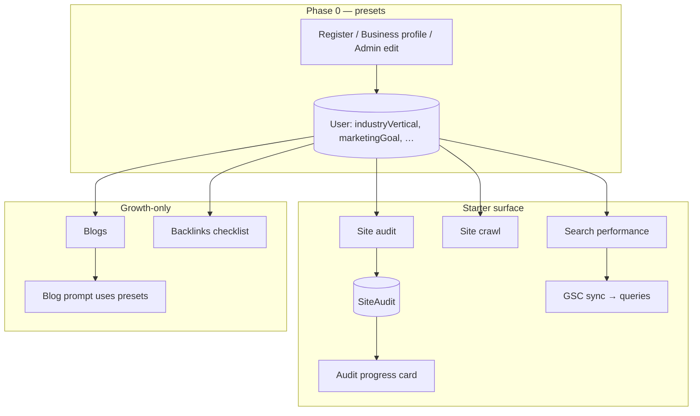
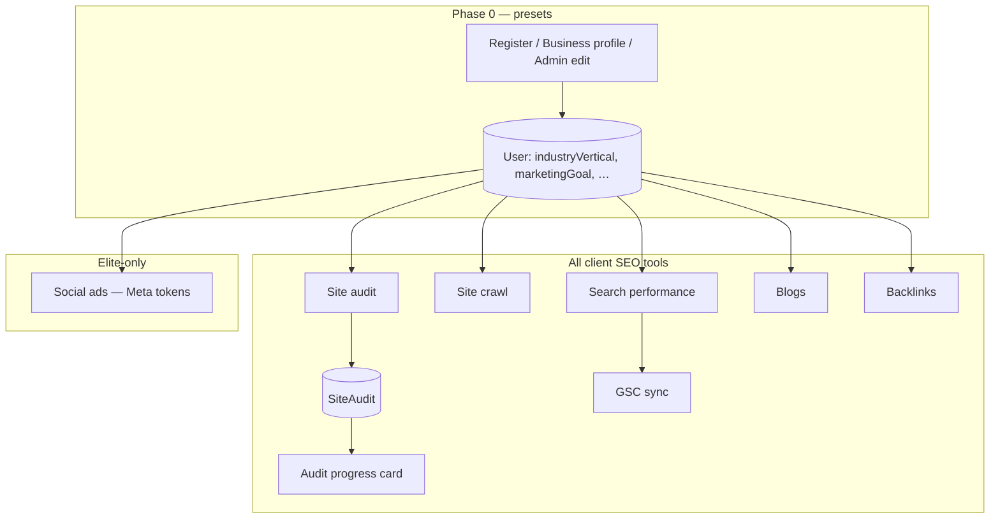

# Phase 0 + Phase 2 — Combined flows by plan

Phase 0 (**F3**) sets **industry vertical** and **marketing goal** (register, business profile, admin edit). Those presets flow into **Site audit** and **blog** prompts.

Phase 2 includes **F18** (audit before/after), **F6** (Search Console OAuth + 28-day query sync), and **F5** (tracked keywords auto-filled from profile, audit pillars, and top GSC queries, with per-plan limits and GSC stats on `/dashboard/keywords`).

---

## Flowcharts (Mermaid)

### Starter (₹499) — audit, crawl, Search Console, presets

### Growth (₹899) — everything in Starter + blogs + backlinks

### Elite (₹1,599) — Growth + social ads

---

## End-to-end test cases (automated + manual)

Automated checks run in CI via `npm run build` (types, Prisma client, route compilation). The rows below are what was verified logically against the code paths; **GSC OAuth** still needs real Google credentials and a property with data for a full live test.

| # | Case | Steps | Expected |
|---|------|--------|----------|
| T1 | Build | `npm run build` | Completes without TypeScript or Next errors |
| T2 | Schema | `npx prisma validate` (optional) | Schema valid |
| T3 | GSC API auth (unauthenticated) | `GET /api/integrations/search-console` without session | `401` |
| T4 | GSC API auth (no plan) | Client session, no active subscription | `403` |
| T5 | OAuth env gate | `GET /api/integrations/search-console/authorize` with session, env vars unset | Redirect to `...?gsc_error=missing_oauth_env` |
| T6 | Disconnect wipes data | `DELETE /api/integrations/search-console` | `GscQueryRow` and `SearchConsoleConnection` removed for user |
| T7 | Dashboard card (0 audits) | Client with plan, no `SiteAudit` | No “Audit progress” card (no first/latest row) |
| T8 | Dashboard card (1 audit) | One `SiteAudit` | Card shows message to run a second audit; no delta table |
| T9 | Dashboard card (2+ audits) | Two+ audits with Lighthouse in JSON | Card shows metric rows and deltas |
| T10 | Search performance gate | Client without active plan opens `/dashboard/search-performance` | Upgrade / plan required message |
| T11 | Search performance nav | Client with Starter+ | Sidebar includes “Search performance” |
| T12 | GSC callback bad state | Open callback with wrong `state` | Redirect with `gsc_error=invalid_state` |

**Manual (staging with real Google Cloud app)**

| # | Case | Expected |
|---|------|----------|
| M1 | Connect | Completes OAuth, property picked from `businessUrl` host when possible, redirect `?gsc=connected` |
| M2 | Sync | “Sync now” returns 200; table fills when GSC has query data; `lastSyncError` null on success |
| M3 | Property mismatch | Business URL host not in GSC → `no_property` or first property fallback per `pickSearchConsoleSiteUrl` |

---

## Related code

| Area | Location |
|------|----------|
| GSC OAuth + analytics | `lib/search-console-google.ts`, `lib/search-console-sync.ts` |
| API | `app/api/integrations/search-console/*` |
| UI | `app/dashboard/search-performance/*` |
| F18 helper + card | `lib/audit-before-after.ts`, `components/audit-progress-card.tsx` |
| Plan gates | `lib/plan-access.ts` (`hasAuditAccess`) |
