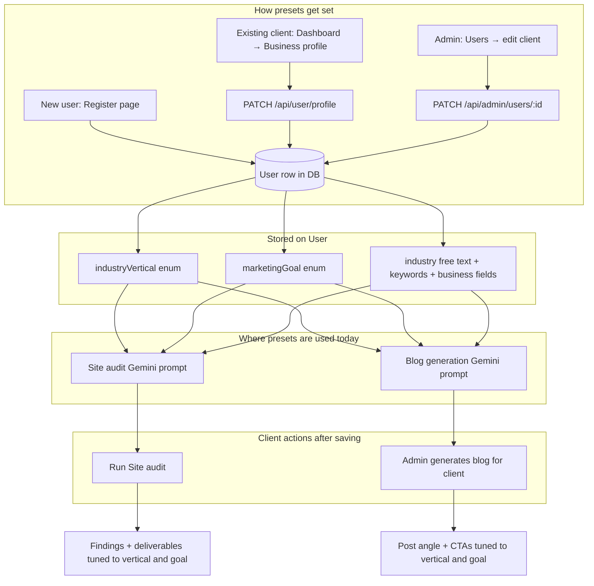

# Phase 0 (F3) — User flow: industry & marketing presets

How **clients** and **admins** set **industry vertical** and **marketing goal**, and where those values affect the product.

---

## Flowchart (Mermaid)

---

## Step-by-step (plain language)

1. **Register**  
   User chooses **Industry vertical** and **Marketing goal** (plus optional free-text industry). Values are saved on the account.

2. **Later changes**  
   User opens **Dashboard → Business profile**, updates presets or business fields, **Save**. The next audit/blog run uses the new values.

3. **Admin override**  
   Admin opens **Admin → Users → [client]**, edits the same fields, **Save**.

4. **What changes for the user**  
   - **Site audit**: AI instructions include extra guidance for the chosen vertical and goal (still grounded in live HTML).  
   - **Blogs** (Growth/Elite): generation prompt includes the same preset tail.

5. **What does not change automatically**  
   Past audit rows in history are unchanged; only **new** runs pick up new presets.

---

## Quick test checklist

- [ ] Register with a non-default vertical/goal → row in DB has `industryVertical` / `marketingGoal`.  
- [ ] **Business profile** → save → reload page → values persist.  
- [ ] Admin user edit → save → client sees updated values on next profile load.  
- [ ] Run audit (with `GEMINI_API_KEY`) → completes without error (prompt includes preset block).  

---

## Related code

| Area | Location |
|------|-----------|
| Enums + User fields | `prisma/schema.prisma` |
| Labels, validation, prompt snippets | `lib/marketing-presets.ts` |
| Audit prompt | `lib/site-audit.ts` |
| Blog prompt | `lib/gemini-blog.ts` |
| Client API | `app/api/user/profile/route.ts` |
| Client UI | `app/dashboard/settings/` |
| Register | `app/register/page.tsx`, `app/api/register/route.ts` |
| Admin | `app/admin/users/[id]/user-edit-form.tsx`, `app/api/admin/users/[id]/route.ts` |
